# [The Hugging Face Deep Reinforcement Learning Course 🤗 (v2.0)](https://huggingface.co/deep-rl-course/unit0/introduction)

This repository contains the Deep Reinforcement Learning Course mdx files and notebooks. The website is here: https://huggingface.co/deep-rl-course/unit0/introduction?fw=pt

- The syllabus 📚: https://simoninithomas.github.io/deep-rl-course

- The course 📚: https://huggingface.co/deep-rl-course/unit0/introduction?fw=pt

- **Sign up here** ➡️➡️➡️ http://eepurl.com/ic5ZUD

<br>
<br>
<br>
<br>

# The documentation below is for v1.0 (depreciated)

We're launching a **new version (v2.0) of the course starting December the 5th,**

The syllabus 📚: https://simoninithomas.github.io/deep-rl-course

## **Sign up here** ➡️➡️➡️ http://eepurl.com/ic5ZUD

<br>
<br>
<br>
<br>

# The documentation below is for v1.0 (depreciated)

In this free course, you will:

- 📖 Study Deep Reinforcement Learning in **theory and practice**.
- 🧑‍💻 Learn to **use famous Deep RL libraries** such as Stable Baselines3, RL Baselines3 Zoo, and RLlib.
- 🤖 Train agents in **unique environments** such as SnowballFight, Huggy the Doggo 🐶, and classical ones such as Space Invaders and PyBullet.
- 💾 **Publish your trained agents in one line of code to the Hugging Face Hub**. But also **download powerful agents from the community**.
- 🏆 **Participate in challenges** where you will evaluate your agents against other teams.
- 🖌️🎨 **Learn to share your own environments made with Unity and Godot**.


The best way to keep in touch is to **join our discord server to exchange with the community and with us** 👉🏻 https://discord.gg/aYka4Yhff9

Are you new to Discord? Check our **discord 101 to get the best practices** 👉 https://github.com/huggingface/deep-rl-class/blob/main/DISCORD.Md

And don't forget to share with your friends who want to learn 🤗!

## The Syllabus 🏗️
This course is **self-paced** you can start when you want 🥳.

| 📆 Publishing date  | 📘 Unit           | 👩‍💻 Hands-on |
|---------------|----------------------------------------------------------|----------------------------------------------------------------------------------------------------------|
| [Published 🥳](https://github.com/huggingface/deep-rl-class/tree/main/unit1#unit-1-introduction-to-deep-reinforcement-learning)  | [An Introduction to Deep Reinforcement Learning](https://github.com/huggingface/deep-rl-class/tree/main/unit1)           | [Train a Deep Reinforcement Learning lander agent to land correctly on the Moon 🌕 using Stable-Baselines3](https://github.com/huggingface/deep-rl-class/blob/main/unit1/unit1.ipynb) |
| [Published 🥳](https://github.com/huggingface/deep-rl-class/tree/main/unit1/unit1-bonus) | [Bonus](https://github.com/huggingface/deep-rl-class/tree/main/unit1/unit1-bonus)                                                    |                                                               |
| [Published 🥳](https://github.com/huggingface/deep-rl-class/blob/main/unit2/README.md)| [Q-Learning](https://github.com/huggingface/deep-rl-class/blob/main/unit2/README.md)                                               | [Train an agent to cross a Frozen lake ⛄ and train an autonomous taxi 🚖](https://github.com/huggingface/deep-rl-class/blob/main/unit2/unit2.ipynb).                                                                                                        |
| [Published 🥳](https://github.com/huggingface/deep-rl-class/tree/main/unit3#unit-3-deep-q-learning-with-atari-games-) | [Deep Q-Learning](https://github.com/huggingface/deep-rl-class/tree/main/unit3#unit-3-deep-q-learning-with-atari-games-)                      | Train a Deep Q-Learning agent to play Space Invaders using [RL-Baselines3-Zoo](https://github.com/DLR-RM/rl-baselines3-zoo)                                                    |
| [Published 🥳](https://github.com/huggingface/deep-rl-class/blob/main/unit3/bonus.md)| [Bonus: Automatic Hyperparameter Tuning using Optuna](https://github.com/huggingface/deep-rl-class/blob/main/unit3/bonus.md)| |                         |                                                    |
| [Published 🥳](https://github.com/huggingface/deep-rl-class/tree/main/unit4#unit-4-an-introduction-to-unity-mlagents-with-hugging-face-) | [🎁 Learn to train your first Unity MLAgent](https://github.com/huggingface/deep-rl-class/tree/main/unit4#unit-4-an-introduction-to-unity-mlagents-with-hugging-face-) | [Train a curious agent to destroy Pyramids 💥](https://colab.research.google.com/github/huggingface/deep-rl-class/blob/main/unit4/unit4.ipynb)  |
| [Published 🥳](https://github.com/huggingface/deep-rl-class/tree/main/unit5#unit-5-policy-gradient-with-pytorch) | [Policy Gradient with PyTorch](https://huggingface.co/blog/deep-rl-pg)                                     | [Code a Reinforce agent from scratch using PyTorch and train it to play Pong 🎾, CartPole and Pixelcopter 🚁](https://colab.research.google.com/github/huggingface/deep-rl-class/blob/main/unit5/unit5.ipynb)                                       |
| [Published 🥳](https://github.com/huggingface/deep-rl-class/tree/main/unit6#towards-better-explorations-methods-with-curiosity) | [Towards better explorations methods with Curiosity](https://github.com/huggingface/deep-rl-class/tree/main/unit6#towards-better-explorations-methods-with-curiosity)|                                                                                                         |
| [Published 🥳](https://github.com/huggingface/deep-rl-class/tree/main/unit7#unit-7-advantage-actor-critic-a2c-using-robotics-simulations-with-pybullet-) | [Advantage Actor Critic (A2C)](https://github.com/huggingface/deep-rl-class/tree/main/unit7#unit-7-advantage-actor-critic-a2c-using-robotics-simulations-with-pybullet-) | [Train a bipedal walker and a spider to learn to walk using A2C](https://github.com/huggingface/deep-rl-class/tree/main/unit7#unit-7-advantage-actor-critic-a2c-using-robotics-simulations-with-pybullet-)                                                                                                        |
| [Published 🥳](https://github.com/huggingface/deep-rl-class/tree/main/unit8#unit-8-proximal-policy-optimization-ppo-with-pytorch) | [Proximal Policy Optimization (PPO)](https://github.com/huggingface/deep-rl-class/tree/main/unit8#unit-8-proximal-policy-optimization-ppo-with-pytorch)                       | [Code a PPO agent from scratch using PyTorch and bulletproof it with Classical Control Environments](https://colab.research.google.com/github/huggingface/deep-rl-class/blob/main/unit8/unit8.ipynb)                                                                                                           |
| [Published 🥳](https://github.com/huggingface/deep-rl-class/tree/main/unit9#unit-9-decision-transformers-and-offline-reinforcement-learning-) | [Decision Transformers and offline Reinforcement Learning](https://github.com/huggingface/deep-rl-class/tree/main/unit9#unit-9-decision-transformers-and-offline-reinforcement-learning-) |  [Train your first Offline Decision Transformer model from scratch to make a half-cheetah run ](https://github.com/huggingface/blog/blob/main/notebooks/101_train-decision-transformers.ipynb)                                                                                                        |


## The library you'll learn during this course
Version 1.0 (current):
- [Stable-Baselines3](https://github.com/DLR-RM/stable-baselines3)
- [RL Baselines3 Zoo](https://github.com/DLR-RM/rl-baselines3-zoo)
- [CleanRL](https://github.com/vwxyzjn/cleanrl)

Version 2.0 (in addition to SB3, RL-Baselines3-Zoo and CleanRL):
- [RLlib](https://docs.ray.io/en/latest/rllib/index.html)
- [Sample Factory](https://github.com/alex-petrenko/sample-factory)
- [Hugging Face Decision Transformers](https://huggingface.co/blog/decision-transformers)
- More to come 🏗️

## The Environments you'll use
### Custom environments made by the Hugging Face Team using Unity and Godot

| Environment     | Screenshot                                       |
|-----------------|--------------------------------------------------|
| Huggy the Doggo 🐶 (Based on [Unity's Puppo the Corgi work](https://blog.unity.com/technology/puppo-the-corgi-cuteness-overload-with-the-unity-ml-agents-toolkit)) | 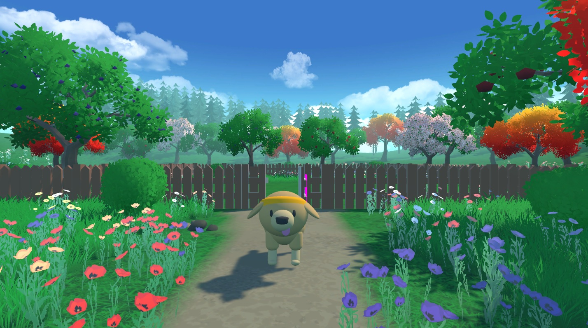 |
| SnowballFight ☃️ 👉 Play it here: https://huggingface.co/spaces/ThomasSimonini/SnowballFight | 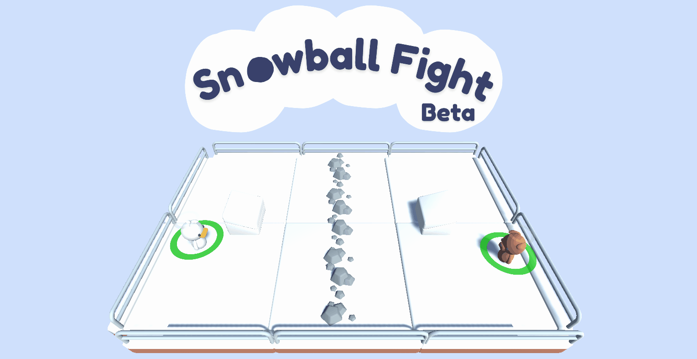 |


### Gym classic and controls environments 🕹️

| Environment     | Screenshot                                       |
|-----------------|--------------------------------------------------|
| Lunar Lander 🚀🌙 | 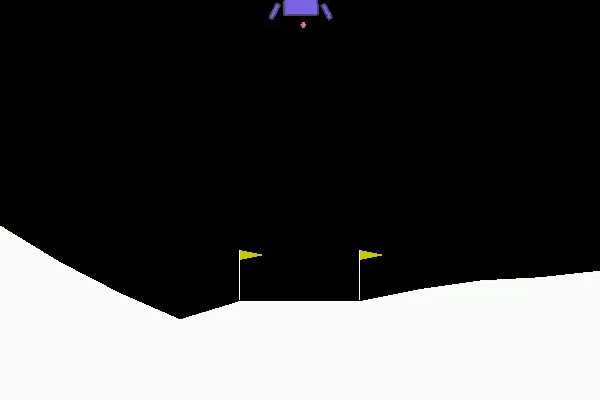 |
| Frozen Lake ⛄   |  |
| Taxi 🚖          | 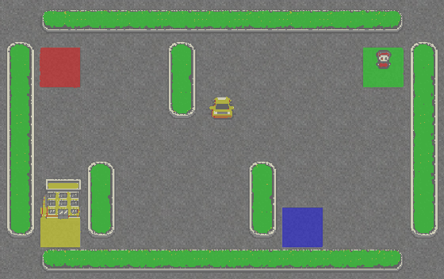 |
| Cartpole          | 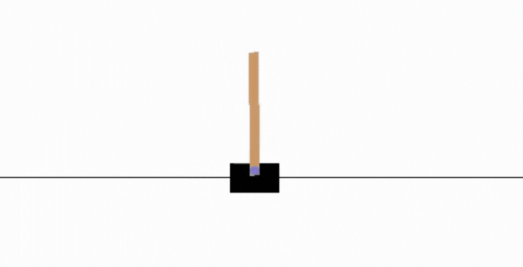 |
| Pong 🎾         |  |
| Pixelcopter 🚁       | 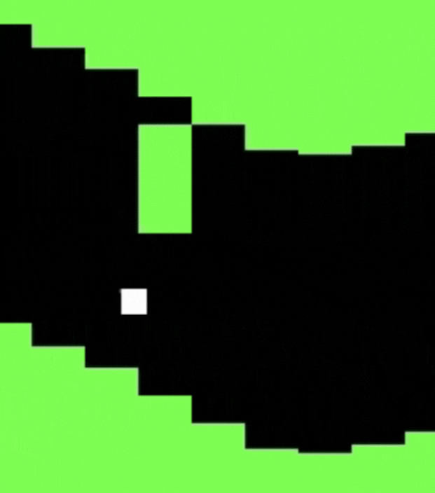 |


### Gym Atari environments 👾

| Environment     | Screenshot                                       |
|-----------------|--------------------------------------------------|
| Space Invaders 👾 | 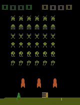 |
| Breakout  | 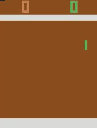 |
| Qbert         |  |
| Seaquest        | 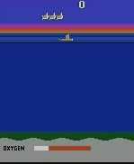 |


### PyBullet 🤖

| Environment     | Screenshot                                       |
|-----------------|--------------------------------------------------|
| Ant Bullet | 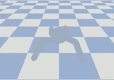 |
| Walker 2D Bullet         | 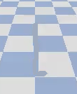 |


### MLAgents environments 🖌️
- More to come 🚧


- More to come 🚧


## Prerequisites
- Good skills in Python 🐍
- Basics in Deep Learning and Pytorch

If it's not the case yet, you can check these free resources:
- Python: https://www.udacity.com/course/introduction-to-python--ud1110
- Intro to Deep Learning with PyTorch: https://www.udacity.com/course/deep-learning-pytorch--ud188
- PyTorch in 60min: https://pytorch.org/tutorials/beginner/deep_learning_60min_blitz.html

## FAQ
**Is this class free?**

Yes, totally free 🥳.


**Do I need to have a Hugging Face account to follow the course?**

Yes, to push your trained agents during the hands-on, you need an account (it's free) 🤗.

You can create one here 👉 [https://huggingface.co/join](https://huggingface.co/join)


**What’s the format of the class?**

The course consists of **8 Units.** In each of the Units, we'll have:

- **A theory explained part**: an article and a video (based on Deep Reinforcement Learning Course)
- **A hands-on Google Colab** where you'll learn to use famous Deep RL libraries such as Stable Baselines3, RL Baselines3 Zoo, and RLlib to train your agents in unique environments such as SnowballFight, Huggy the Doggo 🐶, and classical ones such as Space Invaders and PyBullet.
- **Some optional challenges**: train an agent in another environment, and try to beat the results.

It's not a live course video, so you can watch and read each unit when you want 🤗
You can check the syllabus here 👉 https://github.com/huggingface/deep-rl-class


**What I will do during this course?**

In this free course, you will:

- 📖 Study Deep Reinforcement Learning in theory and practice.
- 🧑‍💻 Learn to use famous Deep RL libraries such as Stable Baselines3, RL Baselines3 Zoo, and RLlib.
- 🤖 Train agents in unique environments such as SnowballFight, Huggy the Doggo 🐶, and classical ones such as Space Invaders and PyBullet.
- 💾 Publish your trained agents in one line of code to the Hub. But also download powerful agents from the community.
- 🏆 Participate in challenges where you will evaluate your agents against other teams.
- 🖌️🎨 Learn to share your own environments made with Unity and Godot.


**Where do I sign up?**

Here 👉 http://eepurl.com/h1pElX


**Where can I find the course?**

**On this repository**, we'll publish every week the links (chapters, hands-ons, videos).


**Where can I exchange with my classmates and with you?**

We have a discord server where you **can exchange with the community and with us** 👉🏻 [https://discord.gg/aYka4Yhff9](https://discord.gg/aYka4Yhff9)

Don’t forget to **introduce yourself when you sign up 🤗**


**I have some feedback**

We want to improve and update the course iteratively with your feedback. If you have some, please fill this form 👉 https://forms.gle/3HgA7bEHwAmmLfwh9


**How much background knowledge is needed?**

Some prerequisites:

Good skills in **Python** 🐍
Basics in **Deep Learning and Pytorch**

If it's not the case yet, you can check these free resources:

- Python: [https://www.udacity.com/course/introduction-to-python--ud1110](https://www.udacity.com/course/introduction-to-python--ud1110)
- Intro to Deep Learning with PyTorch: [https://www.udacity.com/course/deep-learning-pytorch--ud188](https://www.udacity.com/course/deep-learning-pytorch--ud188)
- PyTorch in 60min: [https://pytorch.org/tutorials/beginner/deep_learning_60min_blitz.html](https://pytorch.org/tutorials/beginner/deep_learning_60min_blitz.html)


**Is there a certificate?**

Yes 🎉. You'll **need to upload the eight models with the eight hands-on.**


## Citing the project

To cite this repository in publications:

```bibtex
@misc{deep-rl-class,
  author = {Simonini, Thomas and Sanseviero, Omar},
  title = {The Hugging Face Deep Reinforcement Learning Class},
  year = {2022},
  publisher = {GitHub},
  journal = {GitHub repository},
  howpublished = {\url{https://github.com/huggingface/deep-rl-class}},
}
```
