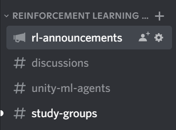

# Unit 1: Introduction to Deep Reinforcement Learning

In this Unit, you'll learn the foundations of Deep RL. And **you’ll train your first lander agent 🚀 to land correctly on the Moon 🌕** using Stable-Baselines3 and share it with the community.

You'll then be able to **compare your agent’s results with other classmates thanks to a leaderboard** 🔥.

This course is **self-paced**, you can start whenever you want.

## Required time ⏱️
The required time for this unit is, approximately:
- 2 hours for the theory
- 1 hour for the hands-on.

## Start this Unit 🚀
Here are the steps for this Unit:

1️⃣ Sign up to our Discord Server. This is the place where you **can exchange with the community and with us, create study groups to grow each other and more** 

👉🏻 [https://discord.gg/aYka4Yhff9](https://discord.gg/aYka4Yhff9).

2️⃣ **Introduce yourself on Discord in #introduce-yourself Discord channel 🤗 and check on the left the Reinforcement Learning section.**

- In #rl-announcements we give the last information about the course.
- #discussions is a place to exchange.
- #unity-ml-agents is to exchange about everything related to this library.
- #study-groups, to create study groups with your classmates.

3️⃣ 📖 Read An [Introduction to Deep Reinforcement Learning](), where you’ll learn the foundations of Deep RL. You can also watch the video version attached to the article. 👉 [ARTICLE LINK]

4️⃣ 👩‍💻 Then dive on the hands-on, where **you’ll train your first lander agent 🚀 to land correctly on the Moon 🌕 using Stable-Baselines3 and share it with the community.** Thanks to a leaderboard, **you'll be able to compare your results with other classmates** and exchange the best practices to improve your agent's scores Who will win the challenge for Unit 1 🏆?

The hands-on 👉

The leaderboard 👉

You can work directly **with the colab notebook, which allows you not to have to install everything on your machine (and it’s free)**.

5️⃣ The best way to learn **is to try things on your own**. That’s why we have a challenges section in the colab where we give you some ideas on how you can go further: using another environment, using another model etc.

## Additional readings 📚
- [Reinforcement Learning: An Introduction, Richard Sutton and Andrew G. Barto Chapter 1, 2 and 3](http://incompleteideas.net/book/RLbook2020.pdf)
- [Foundations of Deep RL Series, L1 MDPs, Exact Solution Methods, Max-ent RL by Pieter Abbeel](https://youtu.be/2GwBez0D20A)
- [Spinning Up RL by OpenAI Part 1: Key concepts of RL](https://spinningup.openai.com/en/latest/spinningup/rl_intro.html)

## How to make the most of this course

To make the most of the course, my advice is to:

- Participate in Discord channel and join a study group.
- Read multiple time the theory part and takes some notes
- Don’t just do the colab. When you learn something try to change the environment, change the parameters and read the libraries documentations. Have fun 🥳

## This is a course built with you 👷🏿‍♀️

We want to improve and update the course iteratively with your feedback. If you have some, please open an issue on the Github Repo: [https://github.com/huggingface/deep-rl-class/issues](https://github.com/huggingface/deep-rl-class/issues)

## Don’t forget to join the Community 📢

We have a discord server where you **can exchange with the community and with us, create study groups to grow each other and more** 

👉🏻 [https://discord.gg/aYka4Yhff9](https://discord.gg/aYka4Yhff9).

Don’t forget to **introduce yourself when you sign up 🤗**

❓If you have other questions, [please check our FAQ](https://github.com/huggingface/deep-rl-class#faq)

Keep learning, stay awesome,
