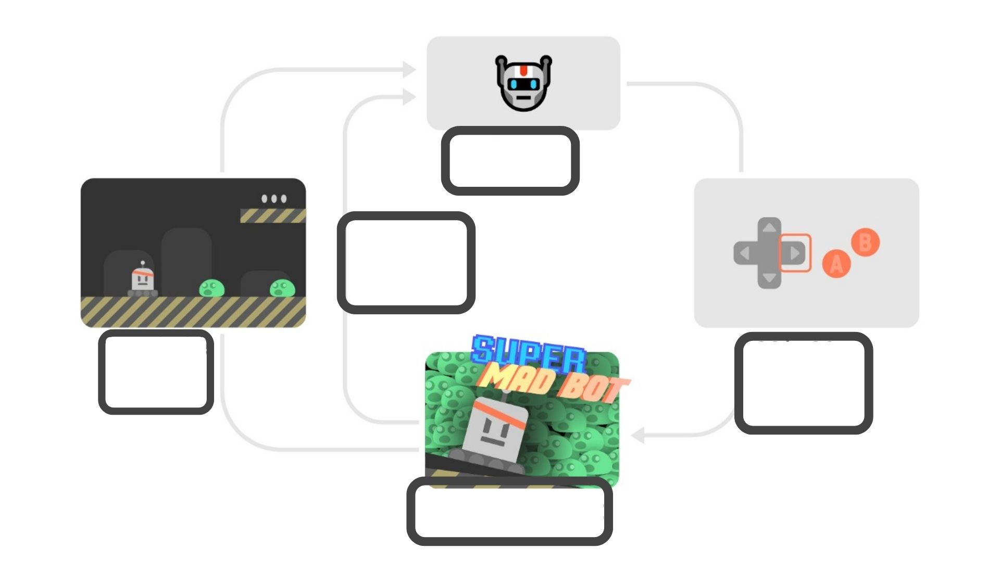
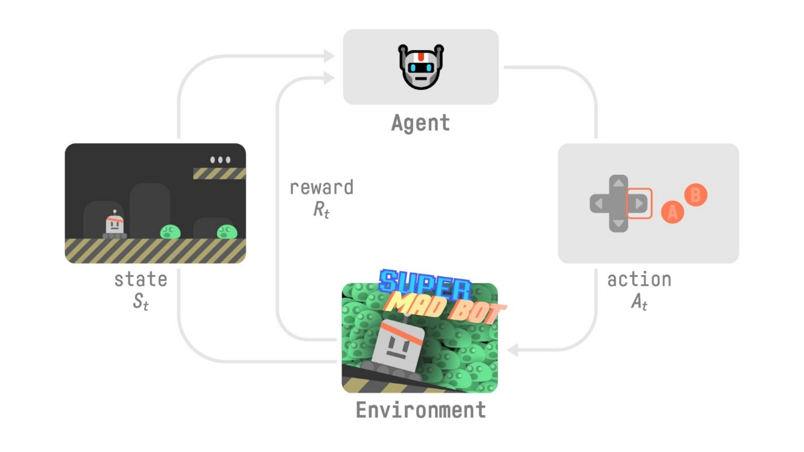
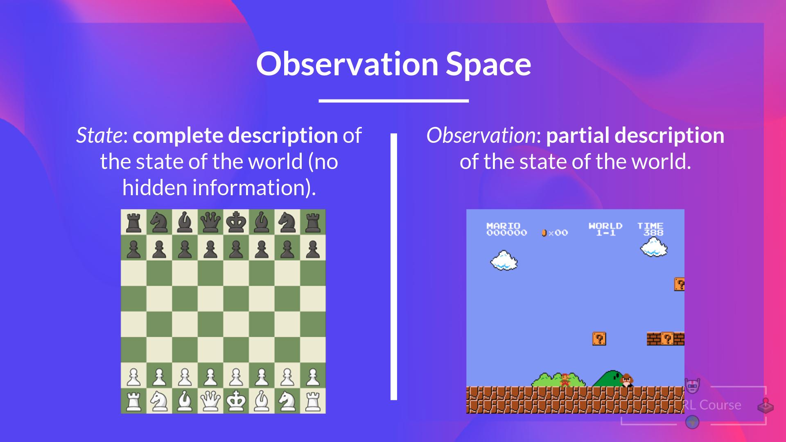
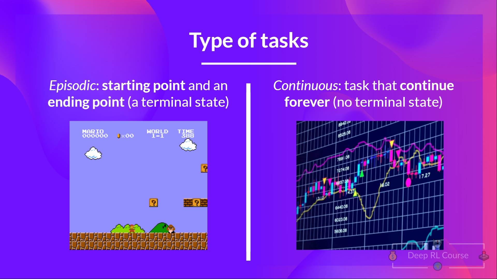
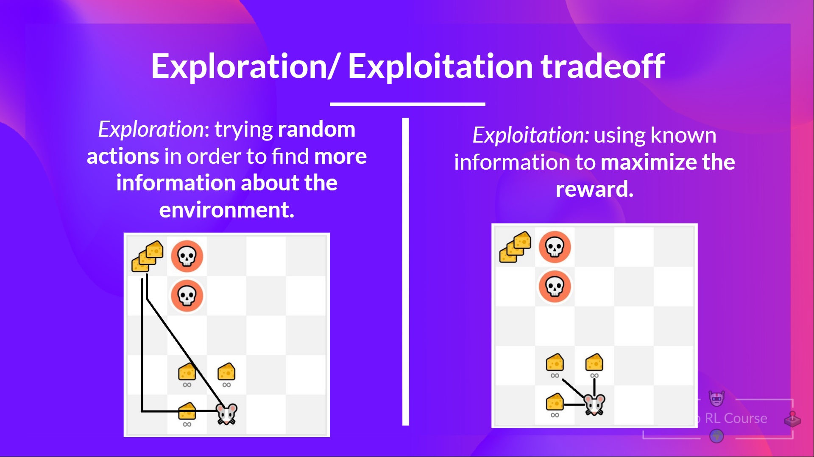
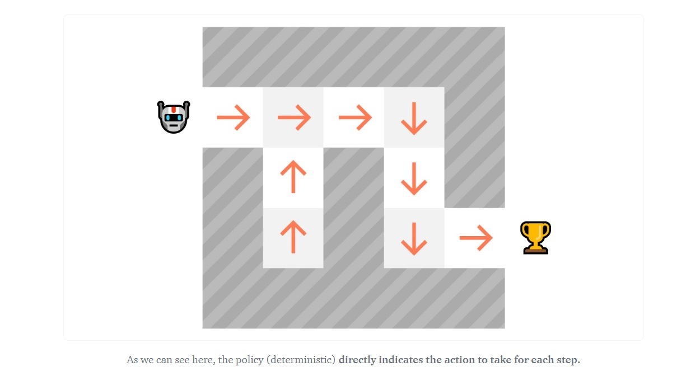
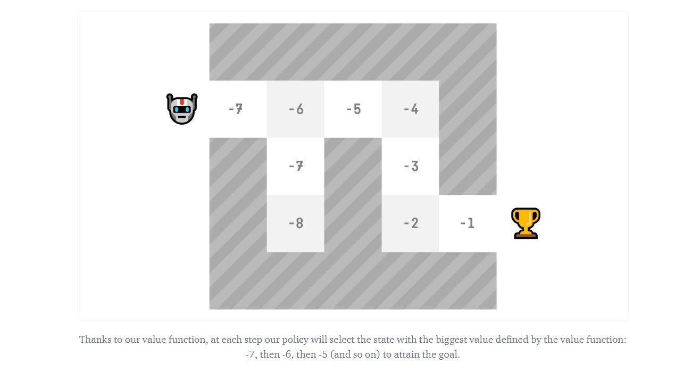

# Knowledge Check ✔️

The best way to learn and [to avoid the illusion of competence](https://fr.coursera.org/lecture/learning-how-to-learn/illusions-of-competence-BuFzf) **is to test yourself.** This will help you to find **where you need to reinforce your knowledge**. 

📝 Take a piece of paper and try to answer by writing, **then check the solutions**.

### Q1: What is Reinforcement Learning?

Solution

  
Reinforcement learning is a **framework for solving control tasks (also called decision problems)** by building agents that learn from the environment by interacting with it through trial and error and **receiving rewards (positive or negative) as unique feedback**.

📖 If you don't remember, check 👉 https://huggingface.co/blog/deep-rl-intro#a-formal-definition
  

### Q2: Define the RL Loop

At every step:
- Our Agent receives ______ from the environment
- Based on that ______ the Agent takes an ______
- Our Agent will move to the right
- The Environment goes to a ______
- The Environment gives ______ to the Agent

Solution

  

At every step:
- Our Agent receives **state s0** from the environment
- Based on that **state s0** the Agent takes an **action a0**
- Our Agent will move to the right
- The Environment goes to a **new state s1**
- The Environment gives **a reward r1** to the Agent
  
📖 If you don't remember, check 👉 https://huggingface.co/blog/deep-rl-intro#the-rl-process

### Q3: What's the difference between a state and an observation?

Solution

  
- *The state* is a **complete description of the state of the world** (there is no hidden information), in a fully observed environment. For instance, in chess game, we receive a state from the environment since we have access to the whole checkboard information.
  
- *The observation* is a **partial description of the state**. In a partially observed environment. For instance, in Super Mario Bros, we only see a part of the level close to the player, so we receive an observation.

  

📖 If you don't remember, check 👉 https://huggingface.co/blog/deep-rl-intro#observationsstates-space

### Q4: A task is an instance of a Reinforcement Learning problem. What are the two types of tasks?

Solution

  
- *Episodic task* : we have a **starting point and an ending point (a terminal state)**. This creates an episode: a list of States, Actions, Rewards, and new States. For instance, think about Super Mario Bros: an episode begin at the launch of a new Mario Level and ending when you’re killed or you reached the end of the level.
  
- *Continuous task* : these are tasks that **continue forever (no terminal state)**. In this case, the agent must learn how to choose the best actions and simultaneously interact with the environment.
  
  
  
📖 If you don't remember, check 👉 https://huggingface.co/blog/deep-rl-intro#type-of-tasks

### Q5: What is the exploration/exploitation tradeoff?

Solution

  
In Reinforcement Learning, we need to **balance how much we explore the environment and how much we exploit what we know about the environment**. 

- *Exploration* is exploring the environment by **trying random actions in order to find more information about the environment**.

- *Exploitation* is **exploiting known information to maximize the reward**.
  
  
  
📖 If you don't remember, check 👉 https://huggingface.co/blog/deep-rl-intro#exploration-exploitation-tradeoff

### Q6: What is a policy?

Solution

  
- The Policy π **is the brain of our Agent**, it’s the function that tell us what action to take given the state we are. So it defines the agent’s behavior at a given time.
  
  

📖 If you don't remember, check 👉 https://huggingface.co/blog/deep-rl-intro#the-policy-%CF%80-the-agents-brain

### Q7: What are value-based methods?

Solution

  
- Value-based methods is one of the main approaches for solving RL problems.
- In Value-based methods, instead of training a policy function, **we train a value function that maps a state to the expected value of being at that state**.

📖 If you don't remember, check 👉 https://huggingface.co/blog/deep-rl-intro#value-based-methods

### Q8: What are policy-based methods?

Solution

  
- In *Policy-Based Methods*, we learn a **policy function directly**.
- This policy function will **map from each state to the best corresponding action at that state**. Or a **probability distribution over the set of possible actions at that state**.

  
📖 If you don't remember, check 👉 https://huggingface.co/blog/deep-rl-intro#value-based-methods
  

---

Congrats on **finishing this Quiz** 🥳, if you missed some elements, take time to [read again the chapter](https://huggingface.co/blog/deep-rl-intro) to reinforce (😏) your knowledge.

**Keep Learning, Stay Awesome**
