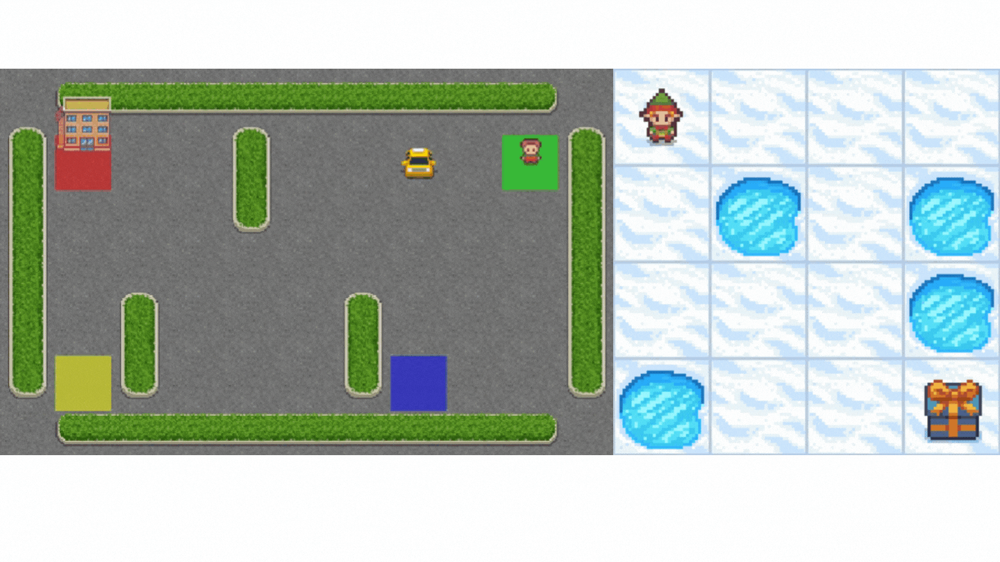
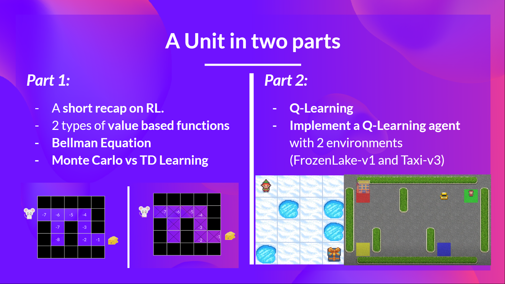

# Unit 2: Introduction to Q-Learning

- [Part 1 is published](https://huggingface.co/blog/deep-rl-q-part1)
- Part 2 **will be published on Friday 📅**

In this Unit, we're going to dive deeper into one of the Reinforcement Learning methods: value-based methods and **study our first RL algorithm: Q-Learning**.

We'll also implement our **first RL agent from scratch**: a Q-Learning agent and will train it in two environments:

- Frozen-Lake-v1 ⛄ (non-slippery version): where our agent will need to go from the starting state (S) to the goal state (G) by walking only on frozen tiles (F) and avoiding holes (H).
- An autonomous taxi 🚕 will need to learn to navigate a city to transport its passengers from point A to point B.

You'll then be able to **compare your agent’s results with other classmates thanks to a leaderboard** 🔥.

This Unit is divided into 2 parts:
- [Part 1 is published](https://huggingface.co/blog/deep-rl-q-part1)
- Part 2 will be published on Friday 📅

This course is **self-paced**, you can start whenever you want.

## Required time ⏱️
The required time for this unit is, approximately:
- 2-3 hours for the theory
- 1 hour for the hands-on.

## Start this Unit 🚀
Here are the steps for this Unit:

1️⃣  If it's not already done, sign up to our Discord Server. This is the place where you **can exchange with the community and with us, create study groups to grow each other and more** 

👉🏻 [https://discord.gg/aYka4Yhff9](https://discord.gg/aYka4Yhff9).

Are you new to Discord? Check our **discord 101 to get the best practices** 👉 https://github.com/huggingface/deep-rl-class/blob/main/DISCORD.Md

2️⃣ **Introduce yourself on Discord in #introduce-yourself Discord channel 🤗 and check on the left the Reinforcement Learning section.**

- In #rl-announcements we give the last information about the course.
- #discussions is a place to exchange.
- #unity-ml-agents is to exchange about everything related to this library.
- #study-groups, to create study groups with your classmates.

3️⃣ 📖 **Read An [Introduction to Q-Learning Part 1](https://huggingface.co/blog/deep-rl-q-part1)**.

## Additional readings 📚
- [Reinforcement Learning: An Introduction, Richard Sutton and Andrew G. Barto Chapter 5, 6 and 7](http://incompleteideas.net/book/RLbook2020.pdf)
- [Foundations of Deep RL Series, L2 Deep Q-Learning by Pieter Abbeel](https://youtu.be/Psrhxy88zww)

## How to make the most of this course

To make the most of the course, my advice is to:

- **Participate in Discord** and join a study group.
- **Read multiple times** the theory part and takes some notes
- Don’t just do the colab. When you learn something, try to change the environment, change the parameters and read the libraries' documentation. Have fun 🥳
- Struggling is **a good thing in learning**. It means that you start to build new skills. Deep RL is a complex topic and it takes time to understand. Try different approaches, use our additional readings, and exchange with classmates on discord.

## This is a course built with you 👷🏿‍♀️

We want to improve and update the course iteratively with your feedback. If you have some, please open an issue on the Github Repo: [https://github.com/huggingface/deep-rl-class/issues](https://github.com/huggingface/deep-rl-class/issues)

## Don’t forget to join the Community 📢

We have a discord server where you **can exchange with the community and with us, create study groups to grow each other and more** 

👉🏻 [https://discord.gg/aYka4Yhff9](https://discord.gg/aYka4Yhff9).

Don’t forget to **introduce yourself when you sign up 🤗**

❓If you have other questions, [please check our FAQ](https://github.com/huggingface/deep-rl-class#faq)

Keep learning, stay awesome,
