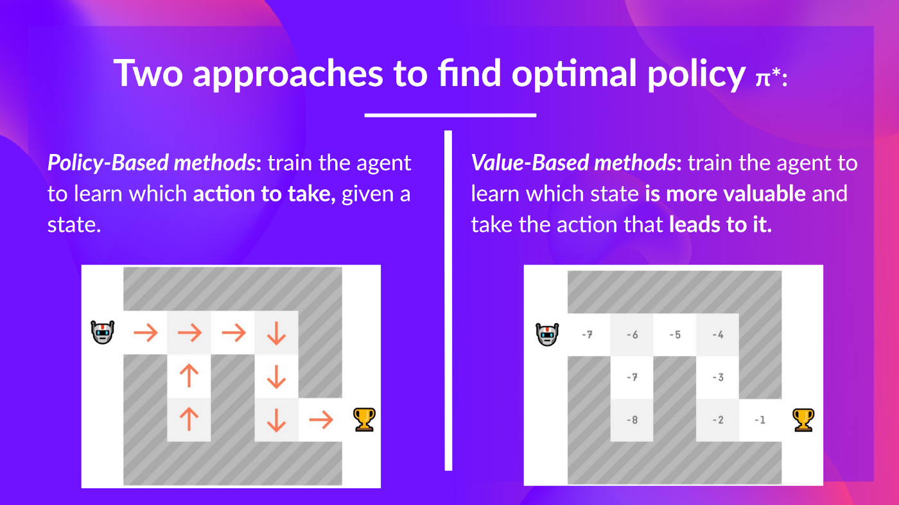
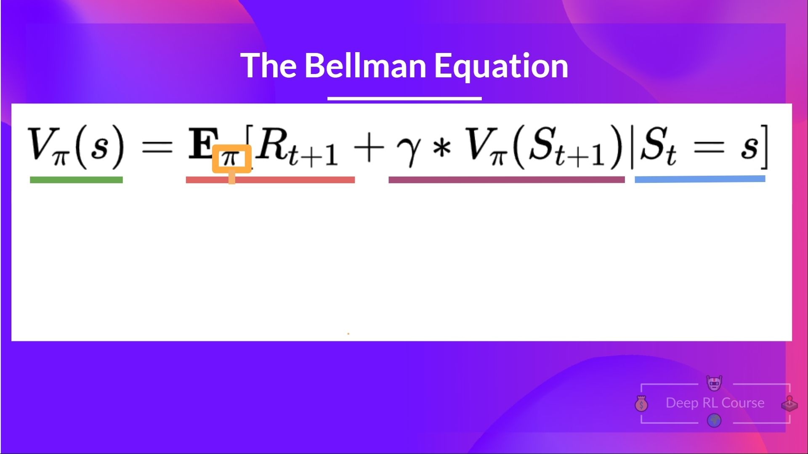
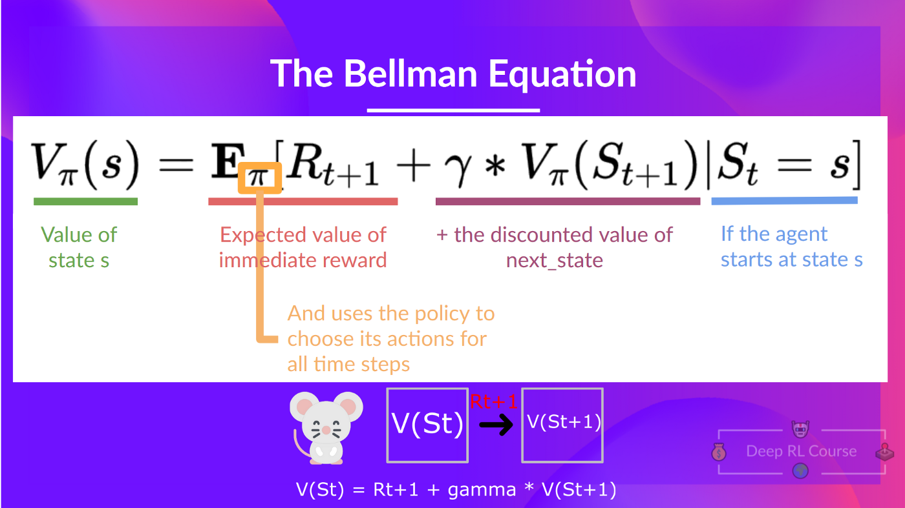
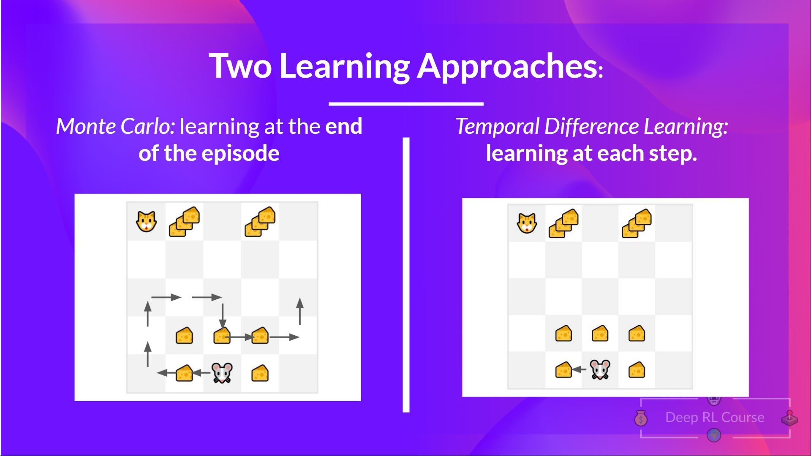
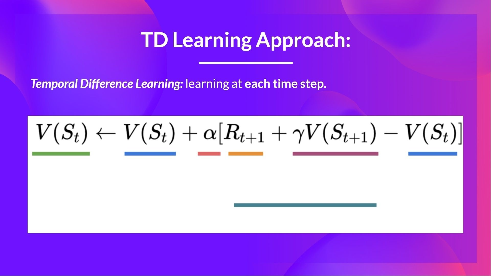
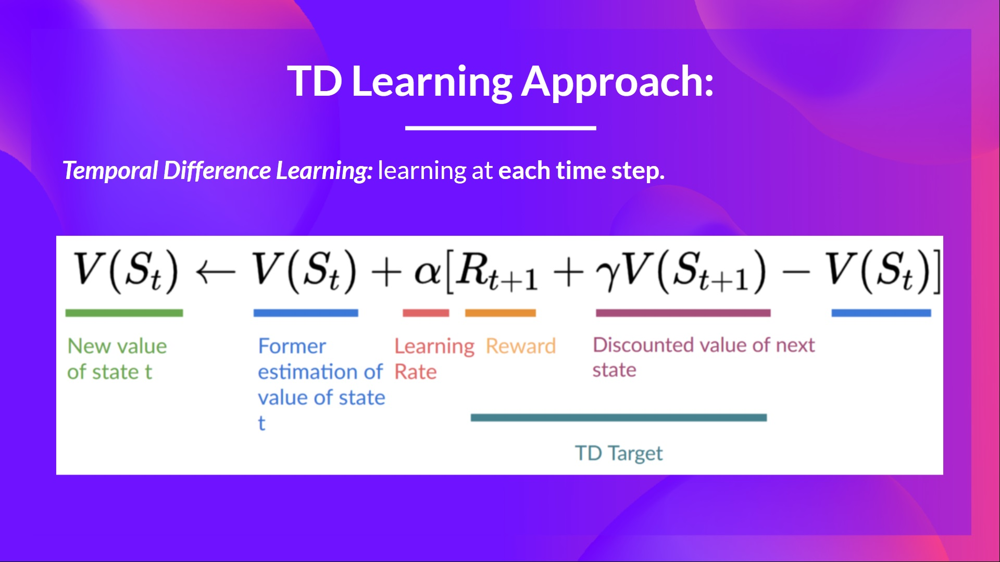
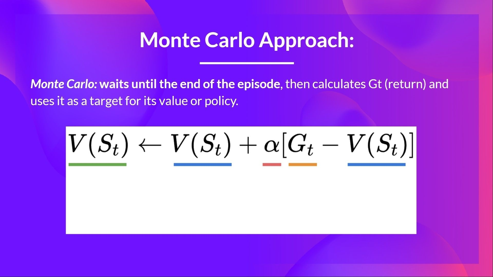
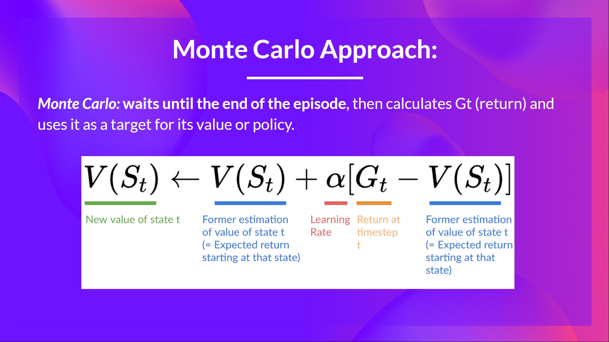

# Knowledge Check ✔️

The best way to learn and [avoid the illusion of competence](https://fr.coursera.org/lecture/learning-how-to-learn/illusions-of-competence-BuFzf) **is to test yourself.** This will help you to find **where you need to reinforce your knowledge**. 

📝 Take a piece of paper and try to answer by writing, **then check the solutions**.

### Q1: What are the two main approaches to find optimal policy?

Solution

  
The two main approaches are:
- *Policy-based methods*: **Train the policy directly** to learn which action to take given a state.
- *Value-based methods* : Train a value function to **learn which state is more valuable and use this value function to take the action that leads to it**.
  

  
📖 If you don't remember, check 👉 https://huggingface.co/blog/deep-rl-q-part1#what-is-rl-a-short-recap
  

### Q2: What is the Bellman Equation?

Solution

  
**The Bellman equation is a recursive equation** that works like this: instead of starting for each state from the beginning and calculating the return, we can consider the value of any state as:

$R_{t+1} + ( gamma * V(S_{t+1}))$

The immediate reward + the discounted value of the state that follows

📖 If you don't remember, check 👉 https://huggingface.co/blog/deep-rl-q-part1#the-bellman-equation-simplify-our-value-estimation
  

### Q3: Define each part of the Bellman Equation

Solution

  
📖 If you don't remember, check 👉 https://huggingface.co/blog/deep-rl-q-part1#the-bellman-equation-simplify-our-value-estimation
  

### Q4: What is the difference between Monte Carlo and Temporal Difference learning methods?

Solution

  
There are two types of methods to learn a policy or a value function:
- With the *Monte Carlo method*, we update the value function **from a complete episode**, and so we use the actual accurate discounted return of this episode.
- With the *TD Learning method*, we update the value function **from a step, so we replace Gt that we don't have with an estimated return called TD target**.

📖 If you don't remember, check 👉 https://huggingface.co/blog/deep-rl-q-part1#monte-carlo-vs-temporal-difference-learning

### Q5: Define each part of Temporal Difference learning formula

Solution

  

📖 If you don't remember, check 👉 https://huggingface.co/blog/deep-rl-q-part1#temporal-difference-learning-learning-at-each-step

  

### Q6: Define each part of Monte Carlo learning formula

Solution

  
📖 If you don't remember, check 👉 https://huggingface.co/blog/deep-rl-q-part1#monte-carlo-learning-at-the-end-of-the-episode

---

Congrats on **finishing this Quiz** 🥳, if you missed some elements, take time to [read the chapter again](https://huggingface.co/blog/deep-rl-q-part1) to reinforce (😏) your knowledge.

**Keep Learning, Stay Awesome**
