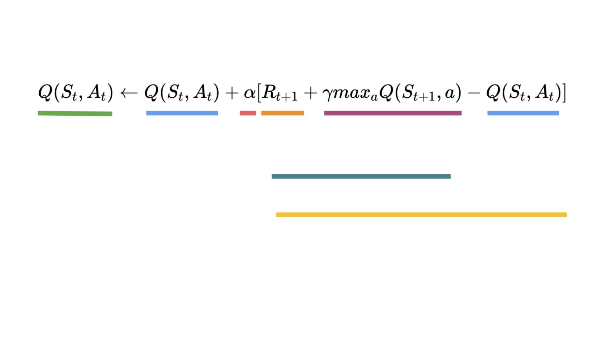
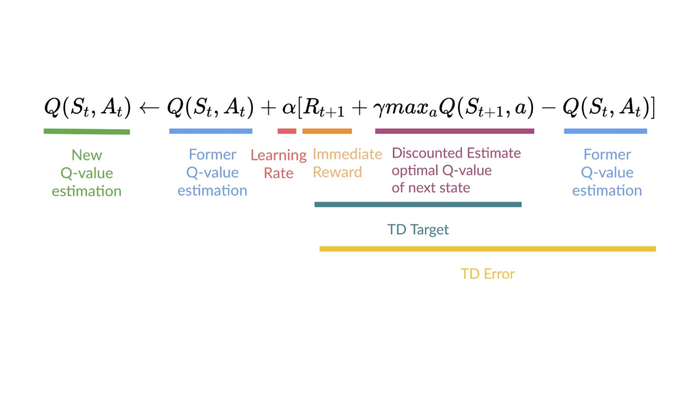

# Knowledge Check ✔️

The best way to learn and [avoid the illusion of competence](https://fr.coursera.org/lecture/learning-how-to-learn/illusions-of-competence-BuFzf) **is to test yourself.** This will help you to find **where you need to reinforce your knowledge**. 

📝 Take a piece of paper and try to answer by writing, **then check the solutions**.

### Q1: What is Q-Learning?

Solution

Q-Learning is **the algorithm we use to train our Q-Function**, an action-value function that determines the value of being at a particular state and taking a specific action at that state.

📖 If you don't remember, check 👉 https://huggingface.co/blog/deep-rl-q-part2#what-is-q-learning

### Q2: What is a Q-Table?

Solution

 Q-table is the "internal memory" of our agent where each cell corresponds to a state-action value pair value. Think of this Q-table as the memory or cheat sheet of our Q-function.
  

📖 If you don't remember, check 👉 https://huggingface.co/blog/deep-rl-q-part2#what-is-q-learning

### Q3: Why if we have an optimal Q-function Q* we have an optimal policy?

Solution

  
Because if we have an optimal Q-function, we have an optimal policy since we know for each state what is the best action to take.
  

📖 If you don't remember, check 👉 https://huggingface.co/blog/deep-rl-q-part2#what-is-q-learning

### Q4: Can you explain what is Epsilon-Greedy Strategy?

Solution

Epsilon Greedy Strategy is a **policy that handles the exploration/exploitation trade-off**.

The idea is that we define epsilon ɛ = 1.0:

- With *probability 1 — ɛ* : we do exploitation (aka our agent selects the action with the highest state-action pair value).
- With *probability ɛ* : we do exploration (trying random action).
  

  
📖 If you don't remember, check 👉 https://huggingface.co/blog/deep-rl-q-part2#the-q-learning-algorithm
  

### Q5: How do we update the Q value of a state, action pair?

Solution

  
  📖 If you don't remember, check 👉 https://huggingface.co/blog/deep-rl-q-part2#the-q-learning-algorithm

### Q6: What's the difference between on-policy and off-policy

Solution

  
  📖 If you don't remember, check 👉 https://huggingface.co/blog/deep-rl-q-part2#off-policy-vs-on-policy

---

Congrats on **finishing this Quiz** 🥳, if you missed some elements, take time to [read the chapter again](https://huggingface.co/blog/deep-rl-q-part2) to reinforce (😏) your knowledge.

**Keep Learning, Stay Awesome**

