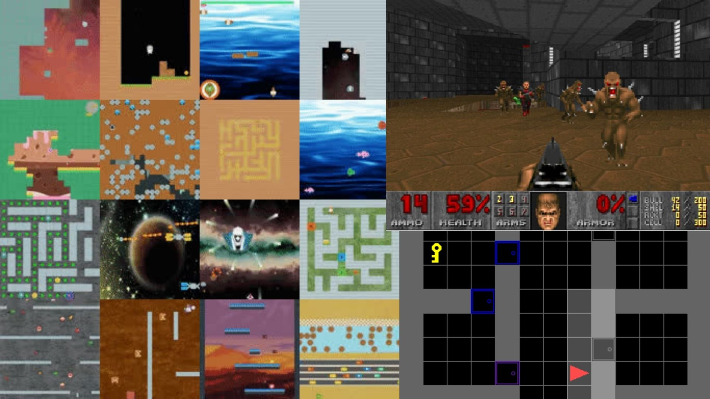

# Unit 2 Bonus 🎁
If you want to go deeper into Stable Baselines3 before our next week unit about Deep Q-Learning you can **check these cool environments 🚀**:

- [Minigrid environment](https://github.com/maximecb/gym-minigrid): puzzle environments where your agent needs to find the way out using keys 🔐 and doors 🚪 : https://github.com/maximecb/gym-minigrid

- [Procgen Benchmark](https://stable-baselines3.readthedocs.io/en/master/guide/examples.html#sb3-and-procgenenv): 16 simple-to-use procedurally-generated gym environments (platform, shooters etc). You have an example with Stable-Baselines3 here: https://stable-baselines3.readthedocs.io/en/master/guide/examples.html#sb3-and-procgenenv

- [VizDoom: a Doom like environment 🔥](https://github.com/mwydmuch/ViZDoom) Nicholas Renotte made a very good tutorial on how to train an agent playing it using Stable Baselines-3: https://youtu.be/eBCU-tqLGfQ

Have fun 🥳

### Keep Learning, Stay awesome
