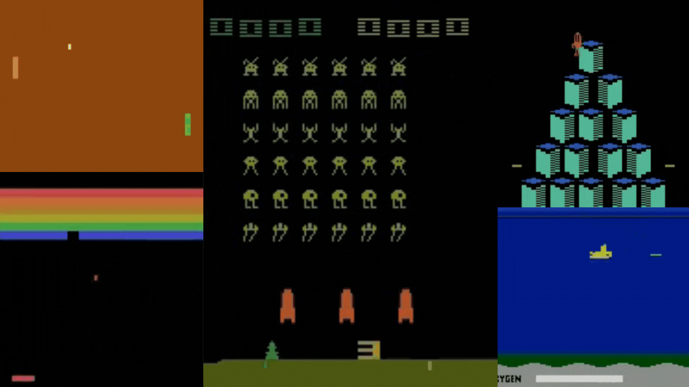

# Unit 3: Deep Q-Learning with Atari Games 👾

In this Unit, **we'll study our first Deep Reinforcement Learning agent**: Deep Q-Learning. 

And **we'll train it to play Space Invaders and other Atari environments using [RL-Zoo](https://github.com/DLR-RM/rl-baselines3-zoo)**, a training framework for RL using Stable-Baselines that provides scripts for training, evaluating agents, tuning hyperparameters, plotting results, and recording videos.

You'll then be able to **compare your agent’s results with other classmates thanks to a leaderboard** 🔥 👉 https://huggingface.co/spaces/chrisjay/Deep-Reinforcement-Learning-Leaderboard

This course is **self-paced**, you can start whenever you want.

## Required time ⏱️
The required time for this unit is, approximately:
- 1-2 hours for the theory
- 1 hour for the hands-on.

## Start this Unit 🚀
Here are the steps for this Unit:

1️⃣ 📖 **Read [Deep Q-Learning with Atari chapter](https://huggingface.co/blog/deep-rl-dqn)**.

2️⃣ 📝 Take a piece of paper and check your knowledge with this series of questions ❔ 👉 https://github.com/huggingface/deep-rl-class/blob/main/unit3/quiz.md

3️⃣ 👩‍💻 Then dive on the hands-on, where **you'll train a Deep Q-Learning agent** playing Space Invaders using [RL Baselines3 Zoo](https://github.com/DLR-RM/rl-baselines3-zoo), a training framework based on [Stable-Baselines3](https://stable-baselines3.readthedocs.io/en/master/) that provides scripts for training, evaluating agents, tuning hyperparameters, plotting results and recording videos.

Thanks to a leaderboard, **you'll be able to compare your results with other classmates** and exchange the best practices to improve your agent's scores Who will win the challenge for Unit 2 🏆?

The hands-on 👉 

The leaderboard 👉 https://huggingface.co/spaces/chrisjay/Deep-Reinforcement-Learning-Leaderboard

You can work directly **with the colab notebook, which allows you not to have to install everything on your machine (and it’s free)**.

4️⃣ The best way to learn **is to try things on your own**. That’s why we have a challenges section in the colab where we give you some ideas on how you can go further: using another environment, using another model etc.

## Additional readings 📚
- [Foundations of Deep RL Series, L2 Deep Q-Learning by Pieter Abbeel](https://youtu.be/Psrhxy88zww)
- [Playing Atari with Deep Reinforcement Learning](https://arxiv.org/abs/1312.5602)
- [Double Deep Q-Learning](https://papers.nips.cc/paper/2010/hash/091d584fced301b442654dd8c23b3fc9-Abstract.html)
- [Prioritized Experience Replay](https://arxiv.org/abs/1511.05952)

## How to make the most of this course

To make the most of the course, my advice is to:

- **Participate in Discord** and join a study group.
- **Read multiple times** the theory part and takes some notes
- Don’t just do the colab. When you learn something, try to change the environment, change the parameters and read the libraries' documentation. Have fun 🥳
- Struggling is **a good thing in learning**. It means that you start to build new skills. Deep RL is a complex topic and it takes time to understand. Try different approaches, use our additional readings, and exchange with classmates on discord.

## This is a course built with you 👷🏿‍♀️

We want to improve and update the course iteratively with your feedback. **If you have some, please fill this form** 👉 https://forms.gle/3HgA7bEHwAmmLfwh9

## Don’t forget to join the Community 📢

We have a discord server where you **can exchange with the community and with us, create study groups to grow each other and more** 

👉🏻 [https://discord.gg/aYka4Yhff9](https://discord.gg/aYka4Yhff9).

Don’t forget to **introduce yourself when you sign up 🤗**

❓If you have other questions, [please check our FAQ](https://github.com/huggingface/deep-rl-class#faq)

### Keep learning, stay awesome,
