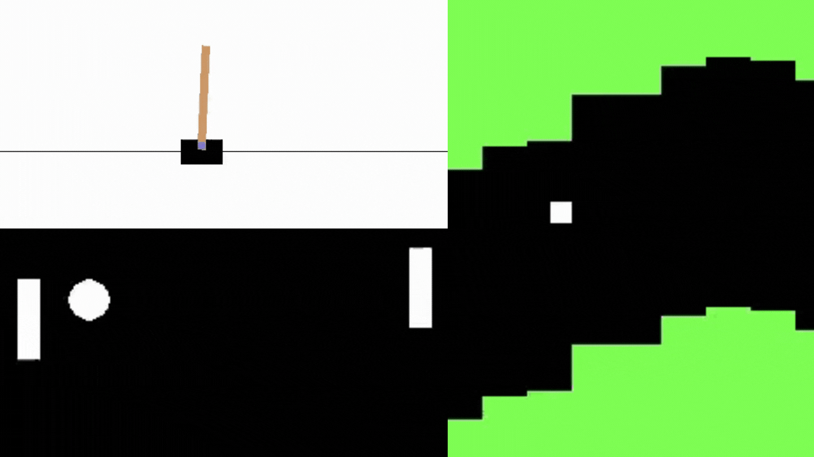

# Unit 5: Policy Gradient with PyTorch 

In this Unit, **we'll study Policy Gradient Methods**. 

And we'll **implement Reinforce (a policy gradient method) from scratch using PyTorch**. Before testing its robustness using CartPole-v1, PixelCopter, and Pong.

You'll then be able to **compare your agent’s results with other classmates thanks to a leaderboard** 🔥 👉 https://huggingface.co/spaces/chrisjay/Deep-Reinforcement-Learning-Leaderboard

This course is **self-paced**, you can start whenever you want.

## Required time ⏱️
The required time for this unit is, approximately:
- 1 hour for the theory
- 1-2 hours for the hands-on.

## Start this Unit 🚀
Here are the steps for this Unit:

1️⃣ 📖 **Read [Policy Gradient with PyTorch Chapter](https://huggingface.co/blog/deep-rl-pg)**.

2️⃣ 👩‍💻 Then dive on the hands-on where you'll **code your first Deep Reinforcement Learning algorithm from scratch: Reinforce**.

Reinforce is a *Policy-Based Method*: a Deep Reinforcement Learning algorithm that tries **to optimize the policy directly without using an action-value function**.
More precisely, Reinforce is a *Policy-Gradient Method*, a subclass of *Policy-Based Methods* that aims **to optimize the policy directly by estimating the weights of the optimal policy using Gradient Ascent**.

To test its robustness, we're going to train it in 3 different simple environments:
- Cartpole-v1
- PongEnv
- PixelcopterEnv

Thanks to a leaderboard, **you'll be able to compare your results with other classmates** and exchange the best practices to improve your agent's scores Who will win the challenge for Unit 5 🏆?

The hands-on 👉 

The leaderboard 👉 https://huggingface.co/spaces/chrisjay/Deep-Reinforcement-Learning-Leaderboard

You can work directly **with the colab notebook, which allows you not to have to install everything on your machine (and it’s free)**.

## Additional readings 📚
- [Foundations of Deep RL Series, L3 Policy Gradients and Advantage Estimation by Pieter Abbeel](https://youtu.be/AKbX1Zvo7r8)
- [Policy Gradient Algorithms](https://lilianweng.github.io/posts/2018-04-08-policy-gradient/)
- [An Intuitive Explanation of Policy Gradient](https://towardsdatascience.com/an-intuitive-explanation-of-policy-gradient-part-1-reinforce-aa4392cbfd3c)

## How to make the most of this course

To make the most of the course, my advice is to:

- **Participate in Discord** and join a study group.
- **Read multiple times** the theory part and takes some notes
- Don’t just do the colab. When you learn something, try to change the environment, change the parameters and read the libraries' documentation. Have fun 🥳
- Struggling is **a good thing in learning**. It means that you start to build new skills. Deep RL is a complex topic and it takes time to understand. Try different approaches, use our additional readings, and exchange with classmates on discord.

## This is a course built with you 👷🏿‍♀️

We want to improve and update the course iteratively with your feedback. **If you have some, please fill this form** 👉 https://forms.gle/3HgA7bEHwAmmLfwh9

## Don’t forget to join the Community 📢

We have a discord server where you **can exchange with the community and with us, create study groups to grow each other and more** 

👉🏻 [https://discord.gg/aYka4Yhff9](https://discord.gg/aYka4Yhff9).

Don’t forget to **introduce yourself when you sign up 🤗**

❓If you have other questions, [please check our FAQ](https://github.com/huggingface/deep-rl-class#faq)

### Keep learning, stay awesome,
