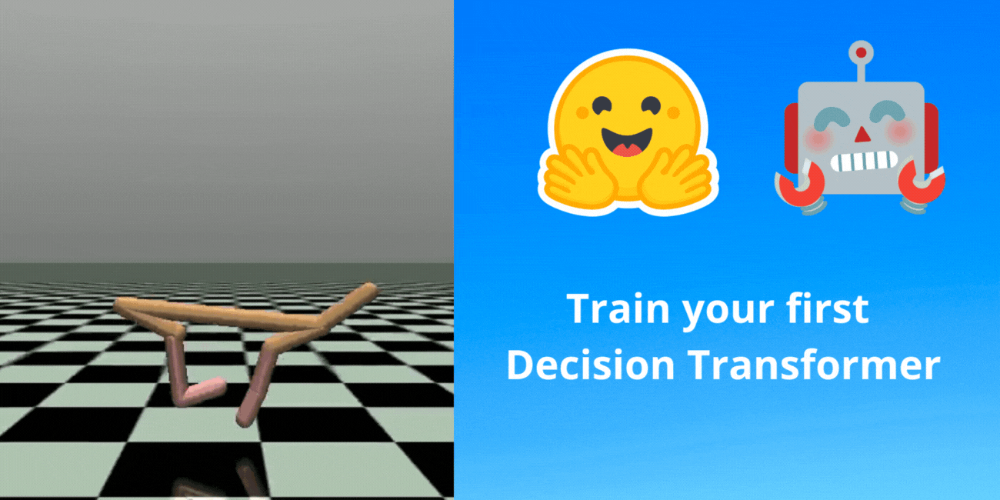

# Unit 9: Decision Transformers and offline Reinforcement Learning 🤖

In this Unit, you'll learn what is Decision Transformer and Offline Reinforcement Learning. And then, you’ll train your first Offline Decision Transformer model from scratch to make a half-cheetah run. 

This course is **self-paced**, you can start whenever you want.

## Required time ⏱️
The required time for this unit is, approximately:
- **1 hour** for the theory
- **1 hour** for the hands-on.

## Start this Unit 🚀
Here are the steps for this Unit:

1️⃣ 📖 Read [Introducing Decision Transformers on Hugging Face 🤗](https://huggingface.co/blog/decision-transformers)

2️⃣ 👩‍💻 Then dive on the first hands-on.
 👩‍💻 The hands-on 👉 
 
3️⃣ 📖 Read [Train your first Decision Transformer](https://huggingface.co/blog/train-decision-transformers)

4️⃣ 👩‍💻 Then dive on the hands-on, where **you’ll train your first Offline Decision Transformer model from scratch to make a half-cheetah run**. 
 👩‍💻 The hands-on 👉 https://github.com/huggingface/blog/blob/main/notebooks/101_train-decision-transformers.ipynb
 
## How to make the most of this course

To make the most of the course, my advice is to:

- **Participate in Discord** and join a study group.
- **Read multiple times** the theory part and takes some notes.
- Don’t just do the colab. When you learn something, try to change the environment, change the parameters and read the libraries' documentation. Have fun 🥳.
- Struggling is **a good thing in learning**. It means that you start to build new skills. Deep RL is a complex topic and it takes time to understand. Try different approaches, use our additional readings, and exchange with classmates on discord.

## This is a course built with you 👷🏿‍♀️

We want to improve and update the course iteratively with your feedback. **If you have some, please fill this form** 👉 https://forms.gle/3HgA7bEHwAmmLfwh9

## Don’t forget to join the Community 📢

We have a discord server where you **can exchange with the community and with us, create study groups to grow each other and more** 

👉🏻 [https://discord.gg/aYka4Yhff9](https://discord.gg/aYka4Yhff9).

Don’t forget to **introduce yourself when you sign up 🤗**

❓If you have other questions, [please check our FAQ](https://github.com/huggingface/deep-rl-class#faq)

## Keep learning, stay awesome 🤗,
